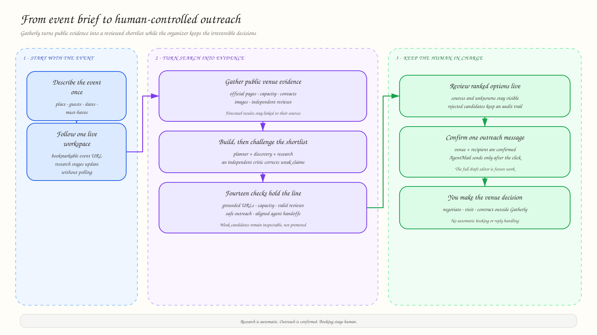
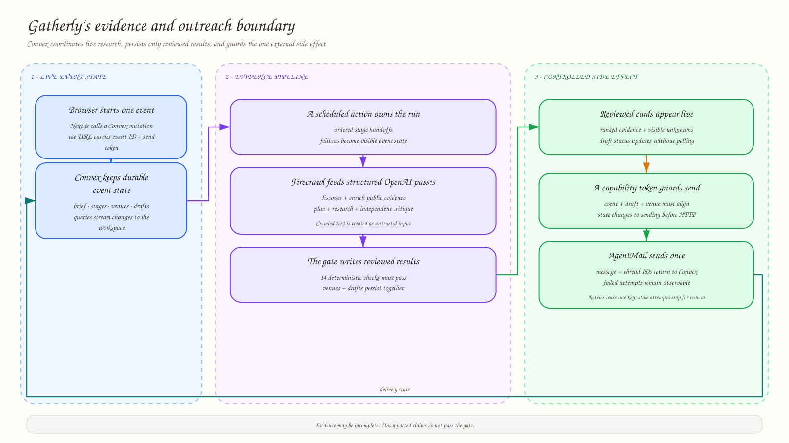

<div align="center">

# Gatherly

**A venue-sourcing workspace that turns an event organizer's plain-language brief into an evidence-backed shortlist and organizer-confirmed outreach.**

[Open the live app](https://limitless-spaniel-248.convex.app)

<!-- README-HACK:NEEDS-OWNER key="demo-video" instruction="Add the final public demo video URL (under three minutes)." -->

</div>

## The idea

Venue sourcing is not one search. An organizer moves between venue sites,
directories, reviews, capacity pages, contact forms, and repeated enquiry
emails—then has to remember which claims were actually supported.

Gatherly turns that fragmented process into one persistent workspace. The
organizer describes the event once; Gatherly searches the public web, checks
the evidence behind each candidate, ranks the viable options, and prepares
outreach without claiming that a venue is available or booked.

## What Gatherly does today

1. The organizer enters a location, guest count, event type, dates, and
   must-haves in ordinary language.
2. Gatherly creates a bookmarkable event workspace and reports each research
   stage through live Convex updates.
3. Firecrawl discovers venues and gathers official pages, capacity evidence,
   images, independent reviews, and public contact routes.
4. OpenAI agents plan the search, select candidates, assemble sourced profiles,
   and independently critique the shortlist.
5. Fourteen deterministic checks reject ungrounded URLs, unsafe outreach,
   duplicate venues, insufficient known capacity, invalid reviews, and broken
   handoffs before results are stored.
6. The workspace presents ranked venue cards, source links, known unknowns,
   and rejected candidates, while Convex stores an outreach draft for each
   retained venue.
7. For venues with a verified public email, AgentMail sends only after the
   organizer confirms that specific draft. The send is idempotent and its
   provider message and thread IDs are persisted.

<p align="center">
  
</p>

## Evidence before recommendation

Gatherly does not treat a search result as a venue fact. Every retained profile
must carry public evidence, every output URL must come from the Firecrawl
evidence bundle, and every numeric capacity claim needs a source. Missing
pricing, accessibility, amenities, reviews, or capacity stays visibly unknown
and lowers the recommendation score instead of becoming an invented positive.

The research pass is challenged by a separate critic before a deterministic
verification gate runs. At least two viable venues must remain, at least one
must expose a public email for AgentMail, and no known capacity may fall below
the organizer's attendance requirement.

## Human control at the irreversible step

Research starts automatically after the visitor supplies their provider access,
but email does not. The live event link contains a generated capability token
that is checked before delivery. The interface
shows the complete draft and asks for confirmation immediately before contacting
AgentMail. Repeated sends reuse the same idempotency key, while uncertain or stale attempts fail for
manual review instead of risking a duplicate message.

## How it works

The Next.js app creates an event through a Convex mutation, keeps the visitor's
provider credentials in browser session storage, and opens the event workspace.
That page starts the Convex research action and streams stage changes back to the
workspace. The action combines Firecrawl discovery and venue-specific
enrichment with structured OpenAI planning, research, and criticism. Only a
shortlist that passes the verification gate is written to the venue and
outreach tables. A separate Convex action owns the organizer-confirmed
AgentMail send and its delivery state.

<p align="center">
  
</p>

## Built with

- Next.js 16, React 19, TypeScript, Tailwind CSS, and shadcn/ui
- Convex tables, indexes, queries, mutations, scheduled functions, actions,
  and realtime subscriptions
- Firecrawl's API for public-web discovery and evidence collection
- OpenAI Responses API structured outputs for planning, discovery, research,
  and independent criticism
- AgentMail for organizer-confirmed email delivery
- Zod, Vitest, Testing Library, and `convex-test`

## Run locally

Prerequisites: Bun 1.4 and a Convex project. Visitors provide their own OpenAI,
Firecrawl, and AgentMail credentials in the live-search form.

```bash
bun install
bunx convex dev
```

Convex writes `NEXT_PUBLIC_CONVEX_URL` to `.env.local` during setup. Provider
credentials are kept in browser session storage and passed only to the matching
Convex action; they are not written to Gatherly event records.

In a second terminal:

```bash
bun run dev
```

Open [http://localhost:3000](http://localhost:3000).

Run the local verification suite with:

```bash
bun run test
bunx tsc --noEmit
bun run lint
bun run build
```

Live Firecrawl and OpenAI evaluation scripts are also available as
`bun run test:e2e` and `bun run test:openai`; the scripts read provider
credentials from the local process environment and may incur usage costs.

## Prototype boundaries

Gatherly currently completes research, shortlist verification, draft creation,
and the first organizer-confirmed outbound email. It does not yet authenticate
users, ingest AgentMail replies, manage follow-up conversations, or complete a
booking, contract, payment, or site visit. Events are publicly readable in this
prototype, so organizers should not enter confidential details.

## What's next

- Add authentication and per-event authorization before accepting real user or
  venue-conversation data.
- Ingest AgentMail replies, summarize missing answers, and keep every follow-up
  behind the same human send boundary.
- Add a comparison and handoff view for availability, pricing, restrictions,
  and final human due diligence.
